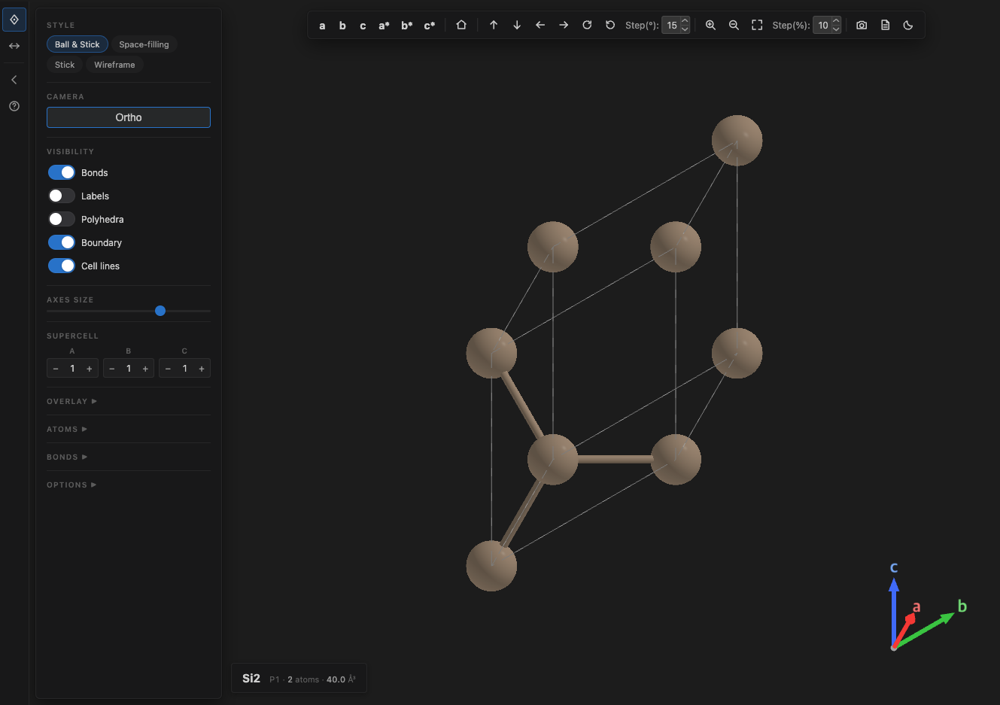

# MatViz — Crystal Structure Viewer for VSCode

<p align="center">
  
</p>

Interactive 3D crystal structure visualization as a VSCode extension,
inspired by VESTA. Handles parsing, rendering, measurement, isosurfaces,
and PNG export for 10+ computational-materials file formats from a single
editor tab.

## Quick start

1. Install the extension (`npm run install-all`, or grab the `.vsix` from releases and `code --install-extension …`).
2. Open a structure file in VSCode. Unambiguous formats (`.cif`, `.xsf`, `POSCAR`, `.xyz`, `.pdb`, `.cube`, `CHGCAR`, `geometry.in`, …) open directly in the 3D viewer.
3. For QE input/output (`.in`, `.out`, `.stdin`, `.stdout`, `.pw`) the file opens as text first — click **Open in MatViz** in the editor title bar to render it.
4. Rotate with the mouse (left-drag) or the ↑↓←→ buttons / keys. Zoom with the wheel or the +/− buttons. Everything else lives in the collapsible left side panel.
5. Press `?` any time to see all keyboard shortcuts. Hover any button or control for a tooltip.

## Supported formats

| Format | Extensions / Filenames | Default open |
|---|---|---|
| CIF | `*.cif` | MatViz |
| POSCAR / VASP | `*.poscar`, `*.vasp`, `POSCAR`, `CONTCAR` | MatViz |
| XSF (incl. AXSF, BLOCK_DATAGRID_3D) | `*.xsf`, `*.axsf` | MatViz |
| XYZ | `*.xyz` | MatViz |
| PDB | `*.pdb` | MatViz |
| Gaussian Cube | `*.cube`, `*.cub` | MatViz |
| VASP Charge Density | `CHGCAR`, `AECCAR0`, `AECCAR2`, `PARCHG` | MatViz |
| FHI-aims | `geometry.in` | MatViz |
| Quantum ESPRESSO | `*.in`, `*.out`, `*.stdin`, `*.stdout`, `*.pw` | Text first — click **Open in MatViz** |

Unambiguous crystallography files open directly in the 3D viewer.
Ambiguous extensions used in lab workflows (QE input/output, SLURM stdout,
etc.) open as text by default; press the **Open in MatViz** button in the
editor title bar to switch to the viewer. If parsing fails, an error toast
with an **Open as Text** action is shown.

## UI layout

The webview is built around the V2 *Floating UI* (shipped in v0.18.0):
3D viewport fills the canvas; chrome floats above as translucent glass
panels.

<p align="center">
  
</p>

- **Mode rail** (full-height left edge): navigate / measure / panel-toggle
  / shortcuts. Glass surface; rendered above all floating chrome
  (z-index 13).
- **Top toolbar**: floating glass pill, centered in the canvas-clear
  region (shifts right when the panel is open). Single row at typical
  editor widths; wraps + shrinks via `@media` breakpoints below the
  natural single-row width.
- **Side panel**: rounded glass card, `8 px` inset from rail / top /
  bottom. Resize by dragging the right edge; collapse via the ◀ button
  on the rail. Inner sections live in a thin custom-scrollbar region.
- **Info pill** (bottom-left): always-visible canonical readout —
  `formula · spg · atoms · volume`. When you click an atom it expands
  with a divider + selected-atom segment (element, index, cart, frac)
  so atom-level info lives in the same chrome instead of a separate
  tooltip.
- **Measure HUD** (top-right, measure mode only): segmented switcher
  (Distance / Angle / Dihedral) + hero number with gradient text +
  atom-pair card + Δ fractional/cartesian rows + Copy button.
- **Axis indicator** (bottom-right by default): right-click + drag to
  reposition anywhere on the canvas. The offset is persisted per file.

## Features

### Rendering

- **Four display styles**: Ball-and-stick (default), Space-filling (vdW
  spheres), Stick (bonds only, atoms shrunk to stick radius), Wireframe
  (lines).
- **Sphere + cylinder impostors** (enabled by default): ray-sphere /
  ray-cylinder intersection in the fragment shader with `gl_FragDepth`,
  replacing tessellated geometry. Produces pixel-perfect atoms and bonds
  at a fraction of the triangle count; scales to 50 000 atoms. Toggle in
  the Options section of the side panel if you want the Phong geometry
  path (e.g., for debugging color mismatch).
- **Chunked InstancedMesh frustum culling**: atoms are spatially binned
  per element so off-screen chunks are skipped — relevant for large
  supercells and stress fixtures (16 k+ atoms).
- **Adaptive LOD**: sphere tessellation scales down as atom count grows.
- **Depth fog**: dense clusters fade toward the background; fog color
  tracks the VSCode theme.

### Navigation

- **Mouse**: left-drag to rotate (quaternion-based, no gimbal lock),
  middle-drag (or right-drag outside the axis indicator) to pan, scroll
  to zoom. Right-drag inside the axis-indicator region repositions the
  indicator instead of panning the camera.
- **Constrained rotation**: Shift+drag locks to one axis, Ctrl/Cmd+drag
  gives screen-Z roll.
- **Quick views**: a, b, c, a\*, b\*, c\* buttons with animated
  transitions.
- **Standard orientation**: Home button (c-axis up, view from a\*).
- **Step rotation**: arrow buttons / keyboard arrows. Shift+arrow for a
  1° fine step. The default step size is set by the **Step(°)** input in
  the top toolbar.
- **Camera toggle**: Orthographic / Perspective button. Orthographic is
  the default for crystallography; perspective is useful for inspecting
  3D polyhedral networks.

### Crystallography

- **CIF symmetry expansion**: Parses both
  `_symmetry_equiv_pos_as_xyz` and `_space_group_symop_operation_xyz`,
  applies operations to the asymmetric unit with duplicate removal
  (tolerance 1e-3 Å fractional).
- **Supercell expansion**: any positive integer per axis (the V2 stepper
  removes the previous 1–5 cap), visualized with dashed internal cell
  boundaries. Bonds, isosurfaces, and polyhedra all re-tile
  consistently with the supercell. Bond detection still hard-skips
  above 5 000 atoms, so very large supercells get the "Compute anyway"
  banner instead of a stalled webview.
- **Boundary atoms** (on by default): atoms that sit on cell
  faces/edges/corners are duplicated to their periodic-image positions
  so the unit cell looks complete from all sides. Wraps fractional
  coordinates into [0, 1) before duplication.
- **Unit cell wireframe**: solid outer edges; dashed internal edges when
  supercell > 1.
- **Lattice planes**: add by Miller indices (hkl) from the command
  palette; any number of planes can be stacked, each in a different
  color.
- **Axis indicator** (bottom-right by default; **right-click + drag** to
  move anywhere): a (red), b (green), c (blue) arrows synchronized with
  camera rotation. Size configurable (60–400 px). Position offset is
  persisted in the saved state so each file remembers where you parked
  it.

### Interaction

- **Navigate mode** (default): click an atom to see its element, global
  index, unit-cell index, cartesian coords, and fractional coords. The
  picked atom info appears as an additional segment in the bottom-left
  info pill (no separate floating tooltip).
- **Measure mode**: pick
  - 2 atoms for distance (Å),
  - 3 atoms for bond angle (°, yellow dashed legs),
  - 4 atoms for dihedral (°, cyan+magenta dashed plane outlines).
  In measure mode the **Measure HUD** appears top-right with a hero
  number + atom-pair card + Δ readouts; press `Esc` or the `✕` button
  to clear.
- **Selection highlight**: selected atoms turn cyan; `Esc` clears them.
- **Hybrid GPU picking**: for structures with ≥ 5 000 atoms, atom picks
  go through a 1×1 WebGL render target (~1 ms); below the threshold the
  CPU raycaster path is used. Both are transparent to the user.
- Mode is chosen from the left rail (navigate / measure icons).

### Atom and bond properties

- **Per-element overrides** (Atoms section):
  - Color picker.
  - Radius slider (0.1–1.5 Å).
  - Visibility checkbox.
- **Per-pair bond parameters** (Bonds section):
  - Enable/disable per pair via iOS-style switch.
  - Min/max distance cutoffs as the unified `.num-wrap` stepper (Å,
    0.05 step). Default: `min = 0.1`, `max = r_A + r_B + 0.3`.
- **Bond-detection skip hint**: if the structure exceeds 5 000 atoms,
  bond detection is skipped by default (O(N) spatial hashing, but each
  voxel scan is nontrivial at that size). A banner in the Bonds section
  explains the skip and shows an estimated time; click **Compute anyway**
  to run it.

### Coordination polyhedra

- Toggle with the **Polyhedra** checkbox in the Visibility section.
- On activation, a **Polyhedra centers** sub-panel appears listing every
  detected element with a checkbox. Check the elements that should act
  as polyhedral centers (e.g., Ti in a perovskite, Si in a silicate).
- **Auto-detect heuristic** pre-ticks elements based on their first
  coordination shell:
  - Max first-shell coordination in [4, 8]
  - Dominant ligand element ≠ self
  - Dominant ligand covers ≥ 85 % of neighbors across atoms of that
    element
- This rejects A-site 12-coordinated cations in perovskites, bridging
  anions (O in ABO3), and homoatomic metallic coordinations. You can
  always override via the checkboxes.
- Polyhedra are built with Three.js `ConvexGeometry` (QuickHull) so
  faces are topologically correct — no spurious interior diagonals on
  near-planar facets.
- Polyhedra default to **off on each file-open** (not restored from
  saved state) so the viewer always starts with a clean scene.

### Volumetric data (isosurfaces)

- **Supported sources**: XSF `BLOCK_DATAGRID_3D`, Gaussian Cube, CHGCAR /
  AECCAR0/2 / PARCHG.
- **Positive / negative lobes** in blue / red (VESTA convention), both
  rendered simultaneously; flip by changing the sign of the level.
- **Controls**: a slider plus a numeric input for precise levels. The
  slider range auto-fits the data's value range on load.
- **Supercell tiling**: the volumetric grid is PBC-tiled to the full
  supercell before marching cubes runs, so inner cell boundaries are
  seamless. The iso reaches exactly to the cell boundary (the `pbc` flag
  on `marchingCubes` processes one additional cube per axis with
  modulo-wrapped samples).
- **Boundary caps** (Method A + Option 2 from the design notes): the six
  outer supercell faces are filled where the iso exits the cell. 2D
  marching-squares on each boundary slice produces the cap polygon,
  closing the iso and giving it a solid "cut" appearance instead of open
  edges.
- **Non-periodic data caveat**: the supercell tiling assumes the input
  is periodic (DFT CHGCAR/XSF always are). Molecular cube files that
  happen to be stored with a large padding box may show visible seams
  between tiled copies — expected.

### Multi-phase overlay (Overlay panel section)

- The side-panel **Overlay** section (collapsed by default) lets you
  load secondary structures as transparent overlays on top of the
  primary — useful for comparing relax/before-after, polymorph
  comparison, defect vs perfect cell, or cross-functional DFT runs.
- Click **+ Add Overlay…** to file-pick another structure. Each loaded
  phase gets a row with visibility / opacity controls.
- **Compare to first overlay**: NN-matched displacement arrows from
  primary atoms to the first phase, color-mapped Viridis. PBC-aware on
  identical lattices (minimum-image distance), raw cartesian otherwise.
- Same capability is exposed in the headless CLI via `--phase` /
  `--compare-to-phase` (see flag table below).

### Export

- **Screenshot** (camera icon in the top toolbar): PNG at 2× pixel
  ratio, composited against the current background.
- **Structure export**: `MatViz: Export as CIF` and `MatViz: Export as
  POSCAR` via the command palette; uses the native VSCode save dialog,
  so there is no path-traversal risk.
- **Open as text**: document icon in the title bar opens the file in
  VSCode's default text editor alongside the 3D view.

### UI details

- **Unified inline-SVG icons** throughout the toolbar + mode rail
  (16×16, 1.5 px stroke, currentColor) — no Unicode/emoji glyphs except
  in the Help overlay's `<kbd>` arrows.
- **iOS-style switches** for every visibility checkbox (Bonds, Labels,
  Polyhedra, Boundary, Cell lines, per-element atoms list, per-pair
  bonds list, etc.). VSCode focus-blue when on; smooth 200 ms thumb
  transition.
- All UI follows the active VSCode theme (dark / light).
- **Palette toggle**: moon / sun icon in the top toolbar flips between
  dark-palette (brightened CPK colors) and light-palette color schemes;
  independent from the editor theme.
- **Responsive toolbar**: content-sized centered glass pill at typical
  editor widths; switches to anchored-edges + `flex-wrap: wrap` mode
  with progressively shrunk buttons below the natural single-row width
  (≤ 870 px panel-closed / ≤ 1140 px panel-open). Two further
  shrink-tiers at ≤ 540 / 810 px keep all icons reachable on very
  narrow editor panes.
- **Help overlay**: 4-column grid (Rotation / Navigation / Style /
  Mode), 720 px glass card with a `backdrop-filter` scrim. `?` to
  open; `Esc` to close.
- **Persistent state** (schema v1, stored per-webview): display style,
  camera position/zoom, orthographic/perspective choice, supercell,
  per-element overrides, per-pair bond parameters, panel width and
  collapsed state, iso level, axis indicator size and **drag offset**,
  impostor toggle, polyhedra-center selection. `layoutMode` keys from
  pre-v0.18 sessions are silently ignored on read (V2 is overlay-only).
  `showPolyhedra` is intentionally **not** restored so every
  file-open starts with polyhedra off.
- **Tooltips on hover** for every toolbar button, slider, input, and
  side-panel control.

## Keyboard shortcuts

| Key | Action |
|---|---|
| `↑` / `↓` | Rotate model up / down |
| `←` / `→` | Rotate model left / right |
| `h` / `j` / `k` / `l` | Vim-style rotate (left / down / up / right) |
| `[` / `]` | Rotate around screen-Z (CCW / CW) |
| Shift + key | Fine rotate (1° step) for arrows / hjkl / `[` `]` |
| `+` / `-` | Zoom in / out |
| `1` / `2` / `3` / `4` | Display style: Ball & Stick / Space-filling / Stick / Wireframe |
| `Escape` | Clear selection, measurements, and the selected-atom segment of the info pill; close the help overlay |
| `?` | Open the shortcut-reference modal |
| Right-click + drag on axis indicator | Reposition the indicator anywhere on the canvas |

Digit shortcuts `1`–`4` are skipped when an input/textarea/contenteditable
is focused so digit entry in the Step / Supercell inputs still works.

The rotation *step size* is set by the **Step(°)** input in the top
toolbar (default 15°); the zoom step by **Step(%)** (default 10%).

## Commands (command palette)

Open the command palette with **Cmd+Shift+P** (macOS) / **Ctrl+Shift+P**
(Windows/Linux) and type `MatViz`.

| Command | Description |
|---|---|
| `MatViz: Reset Camera` | Reset to the default view |
| `MatViz: Toggle Bonds` | Show/hide all bonds |
| `MatViz: View Along Direction [uvw]` | Camera along crystallographic direction |
| `MatViz: View Normal to Plane (hkl)` | Camera normal to Miller plane |
| `MatViz: Add Lattice Plane (hkl)` | Add a colored lattice plane |
| `MatViz: Clear Lattice Planes` | Remove all lattice planes |
| `MatViz: Export Screenshot` | Save a PNG of the current viewport |
| `MatViz: Export as CIF` | Export structure as CIF |
| `MatViz: Export as POSCAR` | Export structure as POSCAR |

## Build

```bash
npm install
npm run build          # esbuild dual-entry (extension + webview + CLI renderer)
npx tsc --noEmit       # type check only
```

## Install from source

Full install (VSCode extension + Claude CLI skill):

```bash
npm install
npm run install-all
```

Or step-by-step:

```bash
npm install
npm run build
npx @vscode/vsce package --no-dependencies
code --install-extension vscode-matviz-0.18.1.vsix --force
npm run install-skill   # optional — only if you use Claude Code
```

After reinstalling, close and reopen any matviz tab to pick up the new
build.

## Headless CLI renderer

MatViz ships a command-line renderer for producing PNG images of
structures without opening VSCode — useful in scripts, CI pipelines, or
AI-assisted report workflows. Uses Puppeteer + SwiftShader for software
WebGL2, so it works in headless Linux environments.

```bash
node dist/render.js structure.cif -o out.png [options]
```

Common options:

| Flag | Purpose |
|---|---|
| `-o <path>` | Output PNG path |
| `--width N` / `--height N` | Image size (default 1920×1080) |
| `--style <ball-and-stick\|space-filling\|stick\|wireframe>` | Rendering style |
| `--view <a\|b\|c\|a*\|b*\|c*\|std>` | Predefined camera view |
| `--rotate x,y,z` | Additional rotation in degrees |
| `--supercell a,b,c` | Expand cell (e.g. `2,2,1`) |
| `--camera <ortho\|persp>` | Projection |
| `--palette <dark\|light>` | Theme |
| `--bg <color>` | Background color (CSS hex / name / `transparent`) |
| `--labels` | Show element labels |
| `--polyhedra` | Show coordination polyhedra (auto-detected centers) |
| `--polyhedra-centers Ti,Fe` | Comma-separated list of polyhedra-center elements (implies `--polyhedra`) |
| `--iso <level>` | Isosurface level for volumetric files (both +level and −level are rendered) |
| `--plane h,k,l` | Add a lattice plane by Miller indices |
| `--vectors` | Render per-atom vector arrows. Auto-detected from POSCAR `MAGMOM`, XSF trailing columns (cols 5–7), extended-XYZ `Properties=` (`magmom`/`forces`/`velocities`/`displacements`), CIF `_atom_site_moment_*`. Aliased as `--magmom`. |
| `--vector-colormap <m>` | Arrow color: `redblue` (default; sign-coded by v_z) or `viridis` (sequential by \|v\|). Alias: `--magmom-colormap`. |
| `--vector-scale <s>` | Arrow length, Å per unit-magnitude vector (default `1.0`). Alias: `--magmom-scale`. |
| `--partial-occupancy` | Render sites with `_atom_site_occupancy` < 1 as transparent atoms (opacity = occupancy ratio). Default off — dominant species shown opaque. |
| `--ellipsoids` | Render thermal ellipsoids for atoms with anisotropic U (CIF `_atom_site_aniso_U_*`). Phong-only path. |
| `--ellipsoid-contour <c>` | Probability contour level: `0.5` (default) or `0.9`. Implies `--ellipsoids`. |
| `--wulff "h,k,l,γ; …"` | Render Wulff polytope from semicolon-separated (h,k,l,γ) tuples. γ = relative surface energy per face. |
| `--frame <N>` | Trajectory files: render Nth frame (0-indexed). Out-of-range clamps with warn. Ignored for single-frame inputs. |
| `--all-frames` | Render every trajectory frame as `<output>_NNNN.png` sequence (1-indexed, 4-digit padded). Combines with `ffmpeg` for gif/mp4 (see SKILL.md). Conflicts with `--frame` (all wins + warn). |
| `--phase <file>` | Add a secondary structure as transparent overlay (default offset (0,0,0), opacity 0.5). Repeatable. Single-frame parse for trajectory phase files. |
| `--compare-to-phase` | NN displacement arrows + `[comparison] RMSD: …` stdout summary against the first `--phase`. PBC-aware on identical lattices. Requires `--phase`; incompatible with `--all-frames`. |
| `--no-bonds` / `--no-boundary` / `--no-cell` | Disable bonds / boundary atoms / cell wireframe |

Run `node dist/render.js --help` for the full list.

The `matviz-render` Claude skill lets Claude Code invoke the CLI when
you ask things like "render this POSCAR" or "보고서에 구조 이미지
넣어줘". `npm run install-all` installs both the extension and the
skill; `npm run install-skill` installs the skill only.

## Architecture

Two execution contexts, two bundles:

- **Extension host** (Node.js, `dist/extension.js`): file I/O, parsing,
  custom-editor lifecycle, commands.
- **Webview** (browser, `dist/webview.js` loaded inside VSCode's
  sandboxed iframe): Three.js rendering, shaders, user interaction.
- **CLI renderer** (`dist/render.js` + `dist/render-helpers.js`):
  Node/Puppeteer driver that runs the same rendering pipeline in a
  headless Chromium page.

Data flow: `file → parser → CrystalStructure JSON → postMessage →
webview → Three.js scene`.

Parsers output a common `CrystalStructure` shape (`{ lattice, species,
positions, pbc, volumetric? }`) so adding a format is a parser module +
one line in `src/parsers/index.ts`.

Element data lives in a single source
(`src/shared/elements-data.ts`, 80 elements) imported by both the
extension host and the webview. The CLI renderer inlines a trimmed
subset because its HTML page must be self-contained for Puppeteer.

## License

MIT — see LICENSE file.
